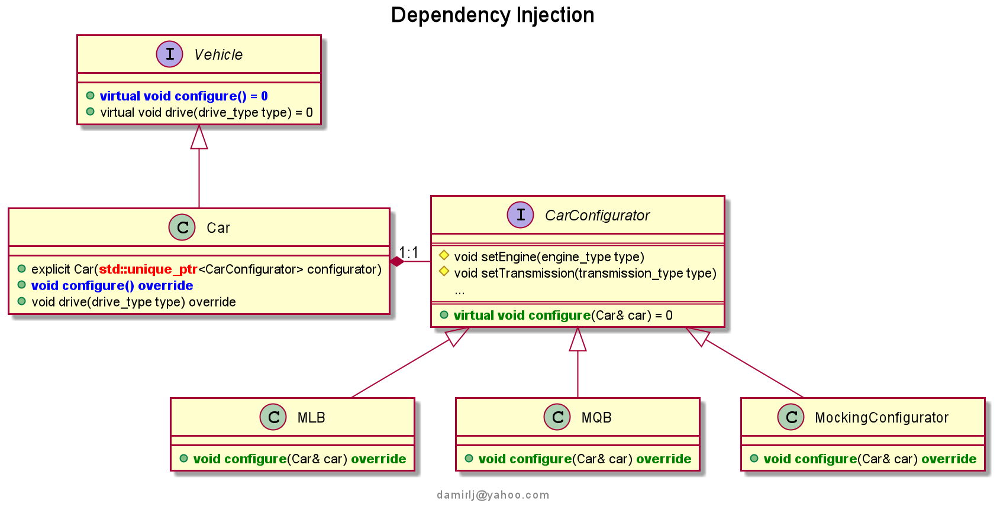

# Table of contents
1. [Introduction](#intro)
2. [Tutorial 1 - AOT](#tut1)
3. [Tutorial 2 - Type traits](#tut2)
4. [Tutorial 3 - Tuples](#tut3)
5. [Tutorial 4 - Functional programming](#tut4)
6. [Tutorial 5 - Dependency Injection](#tut5)
7. [Tutorial 6 - Static polymorphism (or three little pigs)](#tut6)
8. [Tutorial 7 - Type erasure](#tut7)

## Introduction <a name="intro"/>

These are some collection of working concepts that served me as 
teaching platform - for exploring the new features introduced by the latest C++ standards.
Some of them were starting point in implementation of various utility 
classes and libraries in real projects, across different platforms (like socket library, logging mechanism, benchmarking, etc.).
I’ve also used them to introduce the colleagues, as part of the internal discussions and knowledge transfer, the new approaches 
in realization of the well known topics, like concurrency and new memory model, the power of callable objects and 
functional programming, generic – template (meta)programming, chrono library, etc.

Please have in mind that using the code in commercial purposes is not allowed.  
Exposing them to the community is the way for getting the valuable feedback.  
Thanks in advance.  
    
>[Contact](damirlj@yahoo.com)


## Tutorial 1 <a name="tut1"/>

<b>AOT – Active Object Thread</b> design pattern is introduced, as way to have asynchronous inter-thread communication, 
delegating the tasks to the background thread, enqueuing them into the tasks queue.
The thread drains the queue and provides the execution context, a separate one from the thread(s) from which 
the tasks are sent, in which they will be executed sequentially, in order of arrival (FIFO).
The caller thread can be also synchronized on result of task being executed, waiting on signaling the execution completion 
through the communication channel (future).

This concept is heavily used for asynchronous massage-based inter thread communication, especially for time consuming – blocking tasks that are delegated to the background thread in asynchronous way, where order of execution is preserved (first came, first served).    
Typically, you would use this approach for

* <i>Producer-consumer</i> scenarios (audio, video streaming, etc.)
* [Actor model](https://en.wikipedia.org/wiki/Actor_model)
    * example: [Arataga](https://github.com/Stiffstream/arataga)


## Tutorial 2 <a name="tut2"/>
<b>Type traits</b> are small objects for inspecting the type (rather than value) at compile time.
I’ve first encountered the type traits like constructs in [“Modern C++ Design”](https://en.wikipedia.org/wiki/Modern_C%2B%2B_Design) introduced by A. Aleksandrescu and his Loki library.
They are heavily used in template metaprogramming in various scenarios:
-	For **SFINAE**: imposing the template parameter substitution constraints: which types can be potentially consider as a valid for template parameter substitution (instantiation) both, as argument or return values.
-	For checking compile time condition that are type related (if constexpr)
-	For creating function overloading set (tag dispatching)
-	For any compile time type based decisions

This is small demonstration of using type traits with generic programming, where the type needs to be logged to logging medium
either converted to a string (for numeric values), or expecting java-like user-defined types with public non-static member method “toString()”.  
In pre C++17 times, this requirement couldn’t be done as elegant as with compile time <i>if constexpr</i> check

```c++
// Tag dispatching in action for C++14 compiler

using string_tag_v = enum class StringTagValues : uint8_t
{
   tag_string,
   tag_numeric,
   tag_enum,
   tag_invalid
};

using string_tag_t = std::integral_constant<string_tag_v , string_tag_v::tag_string>;
using numeric_tag_t = std::integral_constant<string_tag_v , string_tag_v::tag_numeric>;
using enum_tag_t = std::integral_constant<string_tag_v , string_tag_v::tag_enum>;
using invalid_tag_t = std::integral_constant<string_tag_v , string_tag_v::tag_invalid>;


template <typename T>
std::string conv2string(const T& t, invalid_tag_t)
{
    return {}; //type is not convertible to string
}

template <typename T>
std::string conv2string(const T& t, string_tag_t)
{
    return t;
}

template <typename T>
std::string conv2string(const T& t, numeric_tag_t)
{
    return std::to_string(t);
}

template <typename T>
std::string conv2string(const T& t, enum_tag_t)
{
    const auto e = static_cast<std::underlying_type_t<T>>(t);  

    /*
    * @note: for some compiler the sign promotion may happen
    * enum class : uint8_t
    * passing the scoped enum to std::to_string() may invoke singed promotion, i.e.
    * std::to_string(int) overloading will be called instead of expected std::to_string(unsigned)
    * In case that is building process set to fail on any compiler issues, additional 
    * cast to double is required
    * std::to_string(static_cast<double>(e));
    */
    return std::to_string(e); 
}

template <typename T>
struct is_string_compatible
{
  static constexpr bool value = std::is_same<std::decay_t<T>, std::string>::value ||
					std::is_constructible<std::string, T>::value ||
					std::is_convertible<T, std::string>::value;
};

template <typename T>
std::string conv2string(const T& t)
{
   return conv2string(t,
		   std::integral_constant<string_tag_v,
					is_string_compatible<T>::value ? string_tag_v::tag_string :
					std::is_arithmetic<std::decay_t<T>>::value ? string_tag_v::tag_numeric :
					std::is_enum<std::decay_t<T>>::value ? string_tag_v::tag_enum :  
					string_tag_v::tag_invalid>{});
}
```

## Tutorial 3 <a name="tut3"/>

### Tuples

To be honest, I don't use tuples so frequently in everyday practice, although it's sometime inevitable, even 
recommended.  
Therefore, I’ve decided to introduce some use-cases, where tuples can be quite useful.  

**First scenario** would be if there is some repetitive assignment work, which is non-trivial, because you have 
some nullable, std::optional-like custom data type that may look like
```c++
template <typename T>
struct Optional
{
	bool valid;
	T value;
	...
};
```
Appealing characteristic of _std::tuple_, is that it's fixed-size heterogenous data structure – it can hold different data types.  
We can write a generic class, with variadic number of parameters, stored into tuple as lvalue references.  
To do that, we use *std::tie()* call

```c++
template <class T, class = void>
struct is_optional_t : std::false_type {};

template <class T>
struct is_optional_t<T, std::void_t<decltype(T::valid),	decltype(T::value)>> : std::true_type {};

template <typename...Args>
class Setter
{
    public:

        explicit Setter(Args&...args) noexcept : m_values(std::tie(args...))
        {}
        explicit Setter(std::tuple<Args&...>& values) noexcept : m_values(values)
        {}

        template <std::size_t I, typename Value>
        Setter& set(Value&& value)
        {

            /*
             * This is firstly meant for a non-trivial assignments, that are tedious to
             * write by hand
             *
             */
            auto& opt = std::get<I>(m_values);
            if constexpr (is_optional_t<Value>::value)
            {
                // In case that there is no proper c-tor: for POD like type
                opt.valid = true;
                opt.value = std::forward<Value>(value).value;
            }
            else
            {
                opt = std::forward<Value>(value);
            }

            return *this;
        }

        ...

    private:

        std::tuple<Args&...> m_values; // Store arguments as lvalue references!
        static constexpr size_t N = sizeof...(Args);
};
```

**Second use-case** would be for user-defined types, where you want to provide class specific 
*“less than”* comparison operator, in order to be able to ascending sort the collection of this type using f.e. *std::sort*
algorithm.
>To accomplish this task, one can utilize on the std::tuple internal implementation of comparison 
operators, which is known as *lexicographical (alphabetical) ordering*.
This way, you just wrap your type into std::tuple, instead of writing your own comparison logic, which can be tedious and 
sometime also error-prone task


Consider having simple class which represents the person

```c++
class Person
{
    public:

        Person(int _age, std::string _name, gender_t _gender) noexcept :
            age(_age)
            , name(std::move(_name))
            , gender(_gender)
        {}

        std::string getName() const { return name;}
        int getAge() const { return age;}
        gender_t getGender() const { return gender;}

    private:

        int age;
        std::string name;
        gender_t gender;
};

std::ostream& operator << (std::ostream& out, const Person& p)
{
    return out << "Name=" << p.getName()
               << ", Age=" << p.getAge()
               << ", gender=" << printEnum(p.getGender())
               ;
}

/*
* You can choose class scope - unary, or binary version of 
* the operator <
* The binary version can be implemented also as the friend function, and 
* wrap the private members as references within std::tie,
* instead of use the copied values with std::make_tuple
*/
bool operator < (const Person& p1, const Person& p2)
{
    /*
     * Lexicographic ordering
     *
     * It's relying on the std::tuple internal implementation of the
     * comparison operator ("less than"), instead of writing your own tedious,
     * and error-prone code
     *
     */
    return std::make_tuple(p1.getAge(), p1.getName(), p1.getGender()) <
           std::make_tuple(p2.getAge(), p2.getName(), p2.getGender());
}
```

On the other hand, there is no garantie of the semantical - logical correctness of the comparison.  
Take for instance this example

```c++
struct Point { int x, y;};
```
    
Writing something like  

```c++
bool operator < (const Point& p1, const Point& p2)
{
	return (p1.x < p2.x) && (p1.y < p2.y);
}
```
    
is wrong, in terms of the points in Descartes coordinate system.  
Instead, the correct comparison would be

```c++
bool operator < (const Point& p1, const Point& p2)
{
	   // Distance from (0,0)
	   return (p1.x * p1.x + p1.y * p1.y) < (p2.x * p2.x + p2.y * p2.y);
}
```
    
If you want to rely on the lexicographical (alphabetical) ordering,
you would need manually write, something like

```c++
bool operator < (const Point& p1, const Point& p2)
{
    if (p1.x < p2.x) return true;
    if (p1.y > p2.y) return false;
    
    return p1.x < p2.x;
}
```
which give you, once again, semantically an unsatisfactory result (doesn't concern the coordinates as absolute distance from (0,0)).


Check the [source code](/src/Tutorial%203) for more details on this topic.

## Tutorial 4 <a name="tut4"/>
### Functional programming

It's a common mistake thinking on C++ as a solely OOL  - it's a hybrid language that supports the OOD paradigm, 
but It's also the functional language, especially having in mind that the _std_ library itself is written in a way to follow the
principles of the functional programming: having generic _higher-order_ functions that take as argument another functions,
or return another functions as result. 

The basic idea is to have a generic code, highly customizable, that can be tailored to different kind of scenarios,
by specifying  the callable object that will be internally applied, usually on some iterable collection. 
This generic code introduces some abstraction, by hiding the implementation details - the complexity if you like,
and providing the more expressive code - the code which is concise, compact, easy to read and understand, 
the code which is rather declarative, than imperative. 

For those who are familiar with **Java Streams**, they embody these kind of principals: having chain of composable 
operations - monads, that transform the stream until they reach the terminal operation

```java
List<Person> persons = …
persons.stream()
       .filter(person->person.getAge() >= age) //lambda
       .map(Person::getName) // non-static member method reference
       //.forEach(System.out::println) // static member method reference
      .collect(Collectors.toList());
```

Here, instead of being burden with implementation details (_"how"_ the operators are implemented) - imperative programming, 
we are more focused on _"what"_ should be done, as with declarative programming - expressing our intentions with callable objects 
on a chained operators. You can think of it as Strategy design pattern.
Talking about desing patterns, there is **ReactiveX** library. It's basically an implementation of Publisher-Subscriber 
architectural pattern, that comes in different languages. Java implementation is konw as _RxJava_.
The syntax is very similar with Java Streams, but that is where all other similarity seas. Instead of iterating over the collection, 
the reactive library is for having asynchronous event-based communication between observable (publisher) and observer (subscriber).
We can even specify different thread contexts in which the observable will emit events/items, from the one in which the observer 
will receive these items.
The library itself provides all the necessary infrastructure, so that we, once again, have declarative rather  than imperative programming.

```java
public Disposable test_mapToList()
{
    Button personsButton = (Button) app.findViewById(R.id.button);
    Observable<Unit> personsButtonPublisher = RxView.clicks(personsButton);

    return personsButtonPublisher
            .subscribeOn(Schedulers.io())
            .map(e->{
                List<Person> persons = new ArrayList<Person>();
                Collections.addAll(persons,
                        new Person("Alex", 7, Gender.MALE),
                        new Person("John", 45, Gender.MALE),
                        new Person("Marry", 47, Gender.FEMALE)
                );
                return persons;
            })
            .flatMap((Function<List<Person>, Observable<List<String>>>) persons-> {
                return Observable.fromIterable(persons)
                        .filter(person->person.getAge() > 18)
                        .map(Person::getName) // transformation function f: Person->String
                        .toList()
                        .toObservable();
            })
            .observeOn(AndroidSchedulers.mainThread())
            .subscribe(this::updateNames);
}
```

But, how C++ implementation may look like?

The first, traditional approach - using good-old loop

```c++
/*
 * Imperative way
 *
 * This is actually kind of lifting the generic filter function to
 * be used by the higher-order namesOf function, without having any
 * side-effects: changing the input data
 * So, it's more functional approach, but it uses loop instead of std algorithm, and
 * it's less composable as the genuine functional approach
 */

using persons_t = std::vector<Person>;

template <typename FilterFunc>
std::vector<std::string> namesOf(const persons_t& persons, FilterFunc filter)
{
    std::vector<std::string> names;
    names.reserve(persons.size());

    for (const auto& person : persons)
    {
        if (filter(person))
        {
            names.push_back(std::move(person.getName()));
        }
    }

    return names;
}
```

This would be an imperative - or halfway declarative approach. 
To turn it into truly **declarative** way, so that the code is more expressive and reusable,
we need to make separation of concerns. But this flexibility doesn't come without costs.
The main problem is that __std algorithms are not composable__. The reason for that is that 
they use iterators instead of the concreate collections, which requires the auxiliary memory space:
if we want to have a _pure_ function which doesn't alter input collection

__Filter__ function

```c++
template <typename UnaryPredicate> 
persons_t filterPersons(const persons_t& persons, UnaryPredicate p)
{
    persons_t filteredPersons; // auxiliary memory space
    filteredPersons.reserve(persons.size());

    std::copy_if(persons.cbegin(), persons.cend(), std::back_inserter(filteredPersons), p);

    return filteredPersons;
}
```

__Transformation__ function would be

```c++
template <typename Func, typename R = std::invoke_result_t<Func, const Person&>>
auto mapPersons(const persons_t& persons, Func func)
{
    std::vector<R> result; // auxiliary memory space
    result.reserve(persons.size());

    std::transform(persons.cbegin(), persons.cend(), std::back_inserter(result), func);

    return result;
}
```

Eventually, we can write something like

```
print(mapToNames(adults(persons)); // from inner to outher call
```


> **Note** For more details please visit: [__Turorial 4__](/src/Tutorial%204/TestFP.cxx)


There is (starting with C++20) range library, which simplified the syntax using '|' operator

```c++
auto adultsNames(const persons_t& persons) 
{
    return persons | filter(is_adult)| transform(to_name); // from left to right
}
```

As we can see, this is the most resemble to the Java Streams solution, without additional penalties 
in terms of introducing the auxiliary memory space. 


#### Functors and monads

Functor: the function which takes as input argument class template of one instance F<T1>, and return the transformed instance 
of the same class template F<T2>:
```c++
template <typename T1, typename Func>
auto map(F<T1> t1, Func f)->decltype(F(f(T1))) 
{
   ...
}

where f: T1->T2 is transformation function. 
```
    
Typical example of a functor is _std::optional<T>_

```c++
template <typename T, typename Func>
auto map(const std::optional<T>& t, Func f) -> decltype(std::make_optional(f(*t)))
{
    if (t) return std::make_optional(f(*t));
    return {};
}
```
    
Let assume we have this two transformation functions

```c++
std::string f1 (const std::string& s); // first transformation function
std::string f2 (const std::string& s); // second transformation function
``` 

Now we can write

```c++
map(map(s, f1), f2); //pay attention that map(s, f1) wraps the result into std::optional<std::string>
``` 

The problem arises when transformation functions return std::optional itself, to indicate the outcome of operation, 
since map(s, f1) would then return std::optional<std::optional<std::string>>.
This is where monads come in rescue, by slightly redefine the transformation helper function 
    
```c++
template <typename T, typename Func>
auto map(const std::optional<T>& t, Func f) -> decltype(f(*t))
{
    if (t) return f(*t);
    return {};
}
```

One interesting monad is also _std::future<T>_ which is used to wait on result of the asynchronous task.
We would usually call std::future::get method, which is blocking call.
In order to be able to combine the results of asyncrhonous tasks in a functional way,
we need helper function that converts blocking get call into non-blocking one.
    
@see [Herb Sutter's talk](https://channel9.msdn.com/Shows/Going+Deep/C-and-Beyond-2012-Herb-Sutter-Concurrency-and-Parallelism)    

```c++
/*
 * std::future<T> as monad.
 *
 * To compose the futures (or better say, asynchronous tasks),
 * we need to convert the blocking std::future::get call into
 * non-blocking one, by spawning another asynchronous task that will wait
 * on previous one being signaled - result being returned
 */
template <typename T, typename Func>
auto then(std::future<T>&& f, Func func)
{
    return std::async(std::launch::async, [f = std::move(f), func]() mutable
            {
                return func(f.get());
            });
}
```

Since this is presentation from the second hand, for this and many other concepts of functional programming,
I would highly recommend to read this exelent book ["Functional Programming in C++" by Ivan Čukić](https://cppcast.com/ivan-cukic)
    
## Tutorial 5 <a name="tut5"/>
DIP - **Dependency Inversion Principle** is one in collection of well-known SOLID principles, which in short
advises that in order to loosely couple on dependency, we should depend on the _abstraction_ rather than on the _concreate implementation_.
This way, we decouple the behavioral aspect of the interface, from its concrete implementation.
In other words, the _Client_ shouldn't be aware of implementation details - nor it should directly instantiate the dependency object, the _Service_.
This should be responsibility of another component, _Injector_ - that would [inject the dependency](https://en.wikipedia.org/wiki/Dependency_injection)
at client side either through

* Constructor of the client
* Setter method
* Interface method
    
```c++
template <typename Service>
struct ServiceSetter
{
    virtual void set(std::shared_ptr<Service> service) = 0;
};

template <typename...Services>
class Client : public ServiceSetter<Services>...
{
};
```
    
In some languages (like Java), there are even  DI Frameworks that can be used for introducing the highly configurable
runtime dependency injection (Spring, Dagger, etc.).

But, what would be **benefit** of this?  
One obviously is for having flexible code, that can be easily configured for different kind of dependency implementations, 
without paying the price of refactoring - changing the code, since the interfaces remaining the same.  
Another benefit would be simplified test scenarios, where the real implementation is replaced with the _mocking_ one.  

### Implementation
    
There is another, more generic term: IOC-_Inversion Of Control_, where DI is just one variation of it.  
We usually talk about the IOC container - a centralized component that holds all dependency modules across the process.
Internally, it holds two associative arrays, since the DO (Dependency Object) can be either obtained as a shared (already created) instance,
or the client can require new instance of DO, which will be then factored - by invoking the matching factory.
This means, that we need to store the arbitrary number of arguments required by the factory, for being able to create on demand,
a new DO instance - on the same argument list. We could use, once again, [*tuple*](/src/Tutorial%203) as a storage for these arguments  

```c++
template <typename DIServiceInterface, typename DIService, typename...Args>
class DIFactory final : IFactory<DIServiceInterface>
{
    ...

    /**
     * For binding the arguments of dependency object - service creation,
     * with factory method
     *
     * <p>
     * The service factory will be placed into IOC container.
     * In case that expectation is that each call of the @see DIFactory#create
     * creates the new instance of the service implementation, to accomplish that,
     * the arguments for the factory function need to be stored into tuple
     *
     * @param args  Service implementation construction arguments
     */
     explicit DIFactory(Args&&...args) noexcept :
        m_args(std::make_tuple(std::forward<Args>(args)...))
    {}

private:
    std::tuple<std::decay_t<Args>...> m_args; // store the arguments
};
```
    
To produce a new instance of DO, we call eventually [std::apply](https://en.cppreference.com/w/cpp/utility/apply) on that tuple  

```c++  
/**
 * Factory method: creates the dependency object, a
 * Service that will be injected at client side.
 *
 * @return  Reference to the service concrete implementation upcasted (RVO)
 *          to the matching interface
 *
 * @note template <class T> class A{ public: A(T* t);};
 * There is no hierarchy "is a" relationship between A<Base> and A<Derived> instances
 * (only between template parameters!)
 */
std::unique_ptr<DIServiceInterface> create() override
{
    return std::apply(
        [](auto&&...args)
        {
            return factory<DIService>(std::forward<decltype(args)>(args)...);
        }
       , m_args);
}
```

In order to be able to store in homogenous collections objects of a different type - we need some kind of
universal type-container, that could hold virtually any type (type erasure).  

>Hint: We don't want to use _void *_.

Since C++17, std library offers exactly what we need - [std::any](https://en.cppreference.com/w/cpp/utility/any).  
Taking into account constraint, that contained type needs to be copy-constructible, we will use std::shared_ptr<T> to  
reference both, not only DO, but also the fatory object.  

```c++
using factories_map = std::unordered_map<std::type_index, std::any>;
using instances_map = std::unordered_map<std::type_index, std::any>;

/**
* Adding to container the factory method for creating the matching
* dependencies
*
* @tparam DIService        Service interface
* @tparam DIServiceImpl    Service concrete implementation
* @tparam Args             Arbitrary argument types
* @param  args             Arguments to construct the concrete service implementation
*/
template <class DIService, class DIServiceImpl, typename...Args>
inline void DIContainer::add(Args&&...args)
{
    using namespace std;

    const auto id = type_index(typeid(DIService)); //C++ "reflection": service interface type index as a key

    const auto it = m_diFactories.find(id);
    if (it != m_diFactories.end()) throw std::runtime_error("DI: Service factory already specified!");

    auto factory = make_factory<DIService, DIServiceImpl>(std::forward<Args>(args)...);
    if (!factory) throw std::runtime_error("DI: Service factory not created!");

    // Save instance - for the case that shared instance is required

    m_diServices[id] = std::any(std::shared_ptr<DIService>(factory->create()));

    // Save service factory - for the case that new instance is required

    m_diFactories[id] = std::any(std::shared_ptr<IFactory<DIService>>(std::move(factory)));
}
```

At client side, we are only aware of the interface - not the concrete implementation.  
To achieve that, to inject a proper implementation, we rely on the **C++ "reflection"**, mapping the index
of the service interface type (_std::type_index_) to the associated counterpart  
    
```c++  
/**
 * Retrieving at client side the concrete service implementation, based on
 * the given service interface type - its std::type_index
 *
 * @tparam DIService    Service interface
 * @param shared        Whether to retrieve the shared reference to the service, or
 *                      create a new instance
 * @return              The reference to the concrete service implementation
 */
template <class DIService>
inline std::optional<std::shared_ptr<DIService>> get(bool shared)
{
     using namespace std;
     // Service interface as key to find the associated implementation
     const auto id = type_index(typeid(DIService)); 
     /*
      * If the shared instance of the service implementation is required,
      * grab from the container the matching one
      */
     if (shared)
     {
         if (const auto it = m_diServices.find(id); it != m_diServices.end())
         {
             return std::any_cast<std::shared_ptr<DIService>>(it->second);
         }
         else
         {
             cerr << "DI: Service implementation not found!\n";
             return nullopt;
         }
     }

     // Otherwise, return the new instance of the service implementation

     if (const auto it = m_diFactories.find(id); it != m_diFactories.end())
     {
         const auto& factory = std::any_cast<const std::shared_ptr<IFactory<DIService>>&>(it->second);
         return factory->create();
     }
     else
     {
         cerr << "DI: Service factory not found!\n";
         return nullopt;
     }
}
```  

Additionally, we can write a generic client as well, that stores the dependencies into type-safe unions [std::variant](https://en.cppreference.com/w/cpp/utility/variant),  
and use the **visitor pattern** along with the function object whose overloading resolution set covers all dependencies.  
Usually, we want to target the single dependency, rather than visit all of them at once.  
For that, we will call _std::holds_alternative_ explicitly, to check whether DO is held by the union  
    
```c++
/**
* Provide for the particular service type
* the callable object that will be invoked
* on the injected service implementation
*
* @param func  Function object that will be invoked on the injected
*              service implementation
* @return      The return value of invocation, for existing service: otherwise, exception will be thrown
*/
template <typename Service, typename Function>
decltype(auto) call(Function func)
{
    if (auto it = std::find_if(m_services.begin(), m_services.end()
    , [](const auto& service)
    {
        return std::holds_alternative<Service>(service);
    }
    ); it != m_services.end())
    {
        return func(std::get<Service>(*it));
    }
    else
    {
        throw std::logic_error("<DI> Non-existing service required!");
    }
}
```

The complete source code with examples is available at: [Tutorial 5](/src/Tutorial%205)
	
## Tutorial 6 - Static polymorphism (or three little pigs) <a name="tut6"/>

Static polymorphism is a collection of the template-based technics to have configurable code, where all dependencies are resolved  
at the compile-time, through the template instantiation.  
One can understand this as a static [dependency injection](#tut5)  

 
	<div align="center">**Img.1** _Three little pigs_</div>
	
>I've addressed this topic metaphorically _"Three little pigs"_. As in the story, they are as any siblings resembled,  
but yet essentially different. And it takes some time (practice), to recognize these differences.  
I'll not reveal who is my favorite one, but I'll do introduce them - so that you can choose on your own preferences.  


### Mixin (Pig#1)

Mixin class (or just mixin) is in essence the parameterized inheritance, it's the way to add additional value - functionality  
to the templetized base class, similar to  the _Decorator_ design pattern.  
Difference is that there is no _"is a"_ relationship between the mixin - host class, and the base class - they  
don't share the same interface, but rather they encapsulate different - orthogonal features.  
It's also known as collaborator-based (or role-based) design, where each mixin class has a distinguished role - 
that can be easily combined with other roles - into resulting type which embeds all of these roles.

There are two issues that should be considered, when we use mixin technic in our design:  
	
#### Scalability  
	
Problem: With linear mixing: `Mixin_1<...<Mixin_n<A>...>`, the resulting type can become quite complex  
and eventually unmanageable.  
For overcoming this issue, so called  [`Mixin Layer`][1][<sup>1</sup>] is introduced.  
Each layer represents a single collaboration, capturing the related roles in form of inner mixins  

```c++
template <typename AnotherLayer>
class ThisLayer : public AnotherLayer
{
    public:
        // Inner mixin classes
        class Mixin1 : public AnotherLayer::Mixin1{...};
        class Mixin2 : public AnotherLayer::Mixin2{...};
};
```

This way we relax the resulting syntax and have more scalable way of exercising this technic  

#### Passing the data - constructing the mixins  

Constructing the result type by passing innermost non-mixin class _constructor overload set_  
to all mixin subclasses, including the outermost one:  
`using Super::Super`  
This works for the case where the mixin classes only contribute with additional functionality (are _stateless_), and therefore being  
default constructible  
	
```c++
template <typename Super>
class ConsoleLogger : public Super
{
    public:
        /* 
         *  Inherits super class c-tor overload resolution set!
         *  It can be constructed in the same way, as base class.
         */
        using Super::Super; 
    ...
};
```	

If this is not the case, if there is a mixin class in chain that is _stateful_: non-default constructable,  
we need to employ _variadic templates_  
	
```c++  
template <typename Super>
class TimeStamp : public Super
{
    /**
     * Mixin class which is not default-constructible
     *
     * @param format    The desirable timestamp format
     * @param args      Arbitrary argument list for constructing the base class
     */
    template <typename...Args>
    explicit TimeStamp(const std::string& format, Args&&...args) noexcept :
                         Super(std::forward<Args>(args)...)
                         , m_format(format)
    {}
    ...
};
```  

At the time when the [article][1][<sup>1</sup>] was published, both of these features were not part of the std library.  
	
The source code which demonstrates using of this technic: [**mixin**](/src/Tutorial%206/mixin)  
	
		
### Policy-based design (Pig#2)

Apparently, the term is first used in the [book][2][<sup>2</sup>] which had the major impact on the future development of the entire language.  
It's another aspect of the parameterized inheritance, where this time the functionality of the template class (policy) is plugged-in into the  
interface of the derived - host class, through inheritance (pubic or private).  
It can be seen as _strategy design pattern at compile-time_, where at client side a different policy implementations can be introduced,  
which makes the code highly configurable - especially for the library  writers.  
When we talk about policies, we talk about the different (*postponed*) design decisions that customize the generic code at client side  
to fulfill certain requirements, as for  
* locking (whether it will be used in single-thread, or multi-thread environment)
* allocation (on the heap, or stack)
* logging (on console, file system, or data base)  
	
etc.  

A basic pattern for using the policy-based designed  

```c++
template <typename LoggingPolicy>
class Host : private LoggingPolicy
{
    public:
        template <typename…Args>
        void f(Args&&…args)
        {
            LoggingPolicy::log(std::forward<Args>(args)…);
            doSomething(std::forward<Args>(args)…);
            ...
        }
};
```
You can even combine this with **Template method** pattern  
	
```c++
template <typename LoggingPolicy>
class Base : private LoggingPolicy
{
    public:
        void f(const std::string& s)
        {
            LoggingPolicy::log(s);
            doSomething(s);
        }
    protected:
       virtual void doSomething(const std::string& s) = 0; // "template" method - customization point
};

template <typename LoggingPolicy>
class Derived : public Base<LoggingPolicy>
{
    private:
        void doSomething(const std::string& s) override {...}
};
```
	
The comprehensive example of using the *locking (threading) policy*, can be found at [**locking policy**](/src/Tutorial%206/locking).  
The inspiration was the famous [Loki library][3][<sup>3</sup>].  


### CRTP - Curiously Recurring Template Pattern (Pig#3)

For a change, let start with a reference code snippet that will lead us to the definition  

```c++
template <typename Implementation>
class Base : public Implementation
{
    // C-tor is private
    Base() {}
    friend Implementation;

    public:

        // Factory method
        template <typename...Args>
        static std::unique_ptr<Base> create(Args&&...args) noexcept
        {
            if constexpr ((std::is_constructible_v<Implementation, Args&&> && ...)) // unary right fold expression
            {
                return std::make_unique<Implementation>(std::forward<Args>(args)...);
            }
            else
            {
                return nullptr;
            }
        }


        template <typename...Args>
        decltype(auto) f(Args&&...args)
        {
            return impl().f_impl(std::forward<Args>(args)...); // for prevent shadowing the names
        }
        ...
    private:
        Implementation& impl()
        {
            return *static_cast<Implementation*>(this);
        }
};
```  
	
The reason to make the constructor of the base class private, is to prevent [mismatch][4][<sup>4</sup>] in specifying the template parameter:  

```c++
class A :public Base<A>{};// OK
class B :public Base<A>{};// compiles, but is mismatch!
```

We need to provide the derived-specific implementation of the base interface  


```c++
class A : public Base<A>
{
    public:
        explicit A(int i) noexcept;
        void f_impl(std::string_view s){...};// Derived class implementation - A::f_impl()
        ...
};
```

At the client side, we can write this pseudo code, to demonstrate the technic  

```c++
	
class Client
{
    public:
        explicit Client(int i) noexcept : m_ptrA(Base<A>::create(i))
        {}
        void foo(std::string_view s, int i)
        {
            if (!m_ptrA) throw std::runtime_error("Invalid pointer.");
            m_ptrA->f(s);// Base class interface - Base<A>::f()
            ...
            
        }

    private:
       std::unique_ptr<A> m_ptrA;
};
```
	
As you could see, the CRTP is the way to have derived-specific implementation that 
will be invoked through the base class interface, whereby the derived class has no _"is a"_ relationship with base class, nor  
inherits the interface of the base class - it just provides the implementation behind the base class interface.  
In practice, that usually means having platform-specific implementation of the base interface (f.e. Audio Driver), which is  
exactly the main idea of the static polymorphism - having the variations of the base interface implementations, resolvable at compile-time.  

>Final thoughts: when you master these valuable technics, with help of your imagination and creativity, you can  
easily turn the "three little pigs" into "three musketeers"  

  
	<div align="center">**Img.2** _Upgraded version of my initial sketch - Alex, my 6 years old son_</div>  
	

The complete source code with examples is available at: [**Tutorial 6**](/src/Tutorial%206)  


### References  
[[1]]: [_Mixin-Based Programming in C++_, Yannis Smaragdakis, Don Batory](https://yanniss.github.io/practical-fmtd.pdf)  
[[2]]: [_Modern C++ desing_, Andrei Alexandrescu](https://en.wikipedia.org/wiki/Modern_C%2B%2B_Design)  
[[3]]: [_Loki library_](https://github.com/snaewe/loki-lib/blob/master/include/loki/Threads.h)  
[[4]]: [_Fluent C++_](https://www.fluentcpp.com/2017/05/12/curiously-recurring-template-pattern/#:~:text=The%20Curiously%20Recurring%20Template%20Pattern%20%28CRTP%29%20is%20a,is%2C%20and%20it%20is%20indeed%20an%20intriguing%20construct.)  

	
[1]: <https://yanniss.github.io/practical-fmtd.pdf> 
[2]: <https://en.wikipedia.org/wiki/Modern_C%2B%2B_Design> 
[3]: <https://github.com/snaewe/loki-lib/blob/master/include/loki/Threads.h> 
[4]: <https://www.fluentcpp.com/2017/05/12/curiously-recurring-template-pattern/#:~:text=The%20Curiously%20Recurring%20Template%20Pattern%20%28CRTP%29%20is%20a,is%2C%20and%20it%20is%20indeed%20an%20intriguing%20construct.>

	

## Tutorial 7- Type Erasure <a name="tut7"/>  

Usually, similar tutorials start with explaining different meanings of the type erasure in different languages.  
For some personal reasons, which I reveal later on, I'll pursuit the same approach here - starting with type erasure in Java.  

### Java type erasure

In Java, templates were not originally included into language core.  
Instead, being inspired with C++, generics are for the first time introduced with Java SE5.  
For the reason of _migration compatibility_ with older non-generic code, instead of **reification** (retaining the type info at run-time:  
converting the parameterized type into concreate one through specialization), the generics are implemented using type erasure [^oracle].
	
What does it actually mean?  

Having code like this in Java  
	
```java
public static <T> List<T> filter(T[] in, Predicate<T> p)
{
    List<T> out = new ArrayList<>();
    for (T el : in) {
        if (p.test(el)) { // filter criteria
            out.add(el);
        }
    }
    
    return out;
}
```
will result in parameterized type T being internally substituted with supreme _Object_ type: **T->Object**  
This doesn't give us a lot flexibility. We can't write, as with C++, something like  

```c++
template <typename T>
class A 
{
  public:
        explicit A(T obj) : m_obj(std::move(obj))
        {}
        void foo()
        {
           m_obj.doSomething();
        }
              
  private:
        T m_obj;
};
```
since _Object_ interface doesn't have "_doSomething_" method.  
We can't use any run-time construct like _new_, _instanceof_, or any reflection indeed,  
since we don't have type information at run-time: it's stripped away,  treating any parameterized type as _Object_.  
	
What is the benefit of that - why don't we use the _Object_ directly instead?  

There are (at least) two reasons:  
* We express with T the intention - generic type (code)
* Type-safety: we still have compile-time type check

Consider this code
```java
public static void printAnyList(List<?> list) {
    for (Object el : list) {
        System.out.println(el);
    }
}
```
and
```java
public static void printObjectList(List<Object> list) {
    for (Object el : list) {
        System.out.println(el);
    }
}
```
where the body of these two methods is the same, but only the first one (argument) is truly generic  

```java
List<Integer> list = Arrays.asList(new Integer[]{1,2,3});
printAnyList(list); // OK: List<Integer> is subtype of List<?>
printObjectList(list); // Error: List<Integer> and List<Object> are not related!
```
We can make this more useful, by bounding the type erasure with some more concreate type than _Object_.  
We can bound type erasure to the **upper bound**:  _<? extends T>_ (T and all subtypes of T)  

```java
public static void startVehicles(List<? extends Vehicle> vehicles) {
    for (Vehicle vehicle : vehicles) {
        vehicle.drive();
        …
    }
}
```
or we can bound it to the **lower bound**: _<? super T>_ (T and all super-types of T)  

```java
public static void addCars(List<? super Car> vehicles, Car[] cars) {
    // Collections.addAll(vehicles, cars);
    for (Car car : cars) {
       vehicles.add(car);
    }
}
```

And now, moment of true: With this digression, I wanted to make an homage to one of my favorite authors, Bruce Eckel[^bruce].  
Secondly, working on Android platform, a part of native code in C++, we also heavily use Java(Kotlin) as well.  

### C++ type erasure

In C++ type erasure has nothing to do with compiler - it's all about design.  
It's powerful **design technic**.  
As **Klaus Iglberger**[^klaus] pointed out in his excellent talk, these are three  
pillars of this technic:
* External polymorphism (and some other patterns)
* templated constructor (of the enclosing class)
* non-virtual interface (of the enclosing class)

#### External Polymorphism

It's design pattern that enables treating (in terms of algorithms) by inheritance unrelated - different types as they polymorphically same:  
as they have a common interface.  
As stated in accompanied article[^external], one of the reasons for using this technic would be in case that you have classes  
originated from different 3<sup>rd</sup> party libraries for which you can't introduced the common ancestor in the inheritance tree,  
and then lately in code upcast them to this common base pointer (dynamic polymorphism).  

Instead, we introduce desired _adaptation interface_.  

Let assume that we want to have a way for logging these classes on some logging medium.  
We specify following adaptation interface, that will be used as a _gateway_ for all these unrelated types  

```c++
struct Logging
{
    virtual ~Logging() = default;
    virtual void log() const = 0;
    
    protected:
        Logging() = default;
};
```
Now we introduce the implementation of the interface that is "type agnostic"  
  
```c++
template <typename T, typename Logger>
class LoggingImpl final : public Logging
{
    public:
        LoggingImpl(const T& type, const Logger& logger) noexcept :
              m_obj(type)
            , m_logger(logger)
        {}

        ~LoggingImpl() override = default;

        void log() const override
        {
              // m_logger.log(dump<T>(m_obj)); // template helper function
               m_logger.log(dump(m_obj)); // free function
        }

    private:
        const T& m_obj; // unmutable object to log
        const Logger& m_logger; // unmutable logger itself
};
```
Actually, any type candidate, would need eventually to adapt its dumping signature, in order to be invoked  
uniformly - in polymorphic way.  
This is here done with the  _dump()_ call, as a "signature adapter".  
This can be either a free function, or a template helper function  

```c++
template <typename T>
std::string dump(const T& t)
{
    return t.toString();  // this would assume that most of the classes have already the same "java-like" signature
}
```
and for those types who don't share the same signature - we have overloading (full) specialization  

```c++
std::string dump<A>(const A& a)
{
    return a.print();
}
```
Follow the [link](/src/Tutorial%207/external_polymorphism) to see the complete source code.  


Let's go one step back - to the behavioral aspect of the (erased) type.  
We specify through the interface, the behavioral affordances as a _gateway_ for parameterized   
type specific implementation that needs to cope with it, without imposing any relationship between types - through inheritance.  
It's also known as [duck typing](https://en.wikipedia.org/wiki/Duck_typing) - what behaves as a duck, will be considered as a duck.  
This allows us to keep the interface and its parameterized type based implementation private (_pimpl idiom_).  
For that, we need an enclosing - wrapper type  

```c++
class Vehicle final
{
    private:
      // Interface
      struct VehicleConcept
      {
          virtual ~VehicleConcept() = default;
          virtual void drive(drive_type type) const = 0;
          virtual void configure() = 0;
        protected:
          VehicleConcept() = default;
      };

      // Internal parameterized type based implementation (pimpl idiom)
      template <typename VehicleType, typename Configurator>
      class VehicleConceptImpl final : public VehicleConcept
      {
        public:
           using vehicle_type = VehicleType;
           using configurator_type = Configurator;

           VehicleConceptImpl(VehicleType&& vehicle, Configurator&& configurator) noexcept
               : m_vehicle(std::move(vehicle)) // take the ownership over the type
               , m_configurator(std::move(configurator))
           {}

           // Interface implementation
           void drive(drive_type type) const override
           {
               m_vehicle.drive(type);
           }

           void configure() override
           {
               m_configurator.configure(m_vehicle);
           }

         private:
           vehicle_type m_vehicle;
           configurator_type m_configurator;
       };

       // the rest of code as non-virtual public interface
};
```

and therefore the appropriate - **templated constructor**: as an entry point for customization  

```c++
class Vehicle
{
  public:
    template <typename VehicleType, typename Configurator>
    Vehicle(VehicleType&& vehicle, Configurator&& configurator)
        : m_vehicle(std::make_unique<VehicleConceptImpl>(std::move(vehicle), std::move(configurator)))
    {}
  private:
    std::unique_ptr<VehicleConcept> m_vehicle; 
}
```

In order to use our enclosing type with **"value semantics"** - to design the user-defined type as an built-in type,  
that can be created on the stack, copied/moved, etc., we need to extend the initial interface with so called  
"virtual copy-constructor"[^johnatan]  

```c++
// Interface
struct VehicleConcept
{
    virtual std::unique_ptr<VehicleConcept> clone() const = 0;   
};

// Internal interface implementation
template <typename VehicleType, typename Configurator>
class VehicleConceptImpl : public VehicleConcept
{
  public:
    std::unique_ptr<VehicleConcept> clone() const override
    {
        return std::make_unique<VehicleConceptImpl>(*this);
    }
};
```

This allows us to write the missing copy functions  

```c++
class Vehicle
{
  public:
    // Copy functions - to support value semantics
    Vehicle(const Vehicle& other) : m_vehicle(other.m_vehicle->clone())
    {}
	
    Vehicle& operator = (const Vehicle& other)
    {
        m_vehicle = other.m_vehicle->clone();
	return *this;
    }
};
```

This is also known as _Prototype pattern_.  
The complete code is available at following [link](/src/Tutorial%207/type_erasure)

To summarize.  

#### Pros
* It outperforms the classical polymorphism in terms of  
    * Tamed inheritance hierarchy, which is handled internally only at the single level (place)
    * Easily extendable (OCP), since the compiler will fabricate for each compatible type a new variant
    * Clear separation of concerns (SRP)
* It outperforms the Dependency Injection as well in terms of performance, since introduces the value semantics  
and reduce the number of small allocations as result of injecting dependent object(s)
  
	
		
#### Cons
* It requires a lot of boilerplate code, by specifying the behavioral affordances through interface, that will be internally  
implemented by simple wrapping it around the parameterized type implementation, and non-virtual interface of the enclosing class  
for forwarding the calls to the private implementation (pimpl idiom). 
* It still employs virtual dispatch, and therefore is not such efficient as [static polymorphism](#tut6)

### References

[^oracle]: [Java generics, Oracle](https://docs.oracle.com/javase/tutorial/java/generics/erasure.html)  
[^bruce]: [Thinking in Java 4th edition, Bruce Eckel](https://en.wikipedia.org/wiki/Thinking_in_Java)  
[^klaus]: [Type Erasure, Klaus Iglberger](https://www.youtube.com/watch?v=jKt6A3wnDyI)  
[^johnatan]: [Type Erasure, Johnatan Müller](https://www.foonathan.net/2020/01/type-erasure/)  
[^external]: [External Polymorphism, Chris Cleeland](http://www.dre.vanderbilt.edu/~schmidt/PDF/External-Polymorphism.pdf)  


